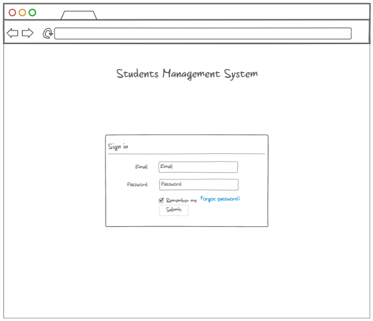

# Basic Sign In and Sign Up, Home Screen

## Short Description

Create an app that reveals authentication practice

## Estimation (h)

20

## Topics

* Angular
* REST API

## Requirements

Create an Angular application that provides with functionality to Sign up to application, Sign in into application, Sign
out of application using standard modules of Angular, like HttpClient, ReactiveForms module etc. For storing users'
data, it is allowed to use simple Local Storage

1. User should be navigated to /sign-in page by default if he is not logged in into system
   
2. User should be registered first before he logs in into application
   
3. User should provide correct username and password to be able to log in into application, same as for sign upping too
4. In case if input is invalid application should show messages with errors that prevents a user from logging in into
   system
5. After user's successful sign up or sign in, the application should navigate to /home
   
6. Sign up & Sign in page should contain header with the name of the app and form with two field for Username and
   password, also there should button to submit provided data
7. Home page should have basic menu at the top of the page with possibility to perform Sign out, also there should be
   printed "Welcome" message

## Advanced Requirements

1. Create separate functionality on corresponding route /users to show the list of users that are registered into
   application 
2. Emulate all the data operations with http calls using HttpClient

## Common Mistakes and Questions

### Questions

Q: Should I use some back-end solution and database?
A: Yes, you are free to emulate API in different ways
