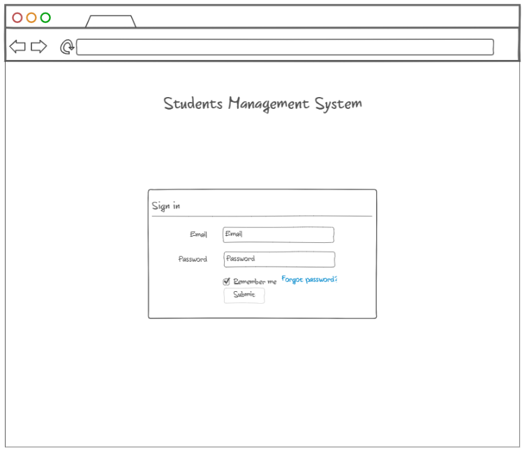
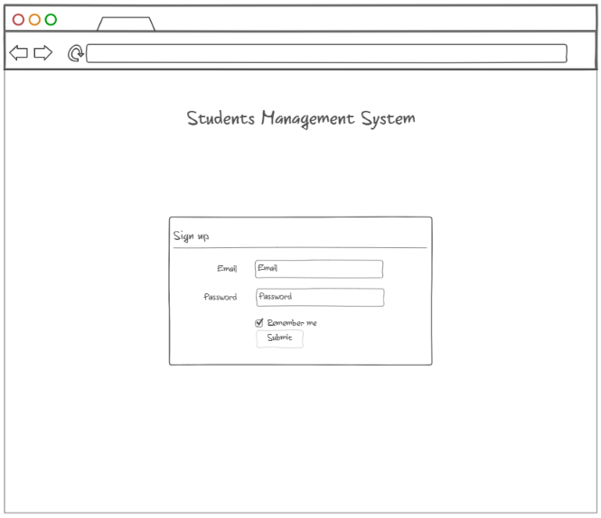
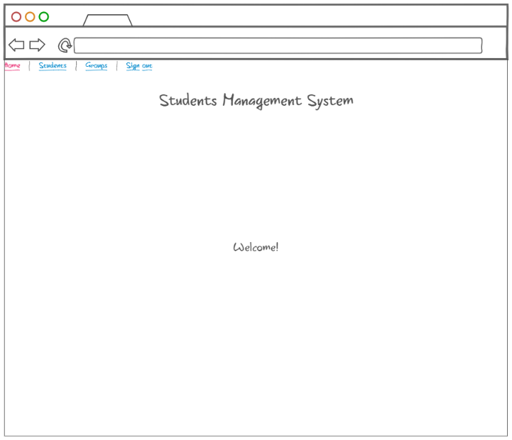
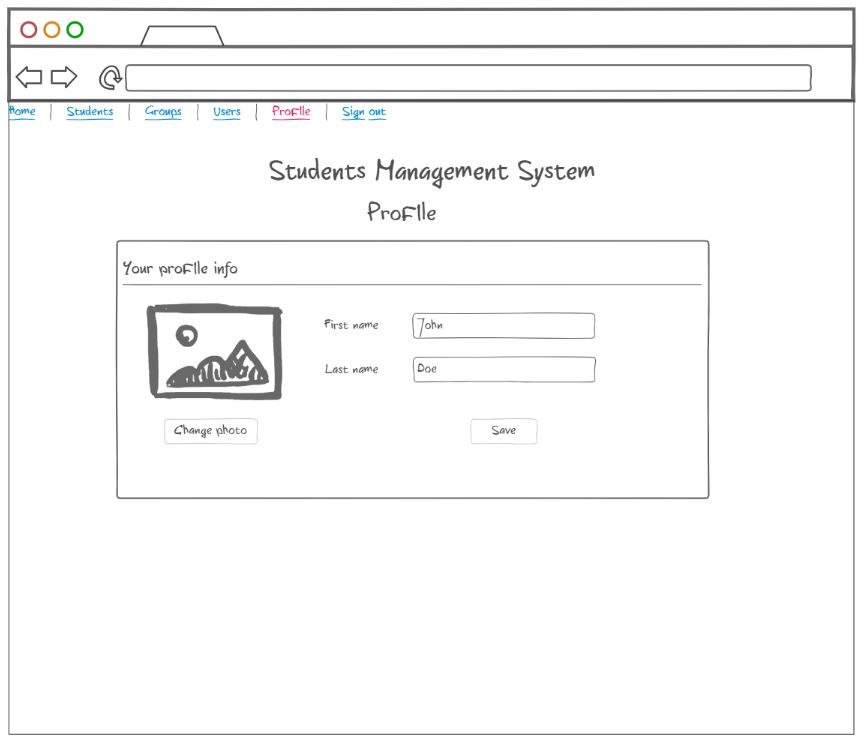

# File Uploading and Image Preview

## Short Description

Enrich existing Students Management Application with file uploading and image preview.

## Estimation (h)

14

## Topics

* Angular
* REST API

## Requirements

Use existing Student Management System application or create new Angular application that has basic setup of Sign In,
Sign Up, Sign Out functionality as well as Profile page which has corresponding area to upload image file for Profile
Avatar and preview it anytime with help of Popup

1. User should be navigated to /sign-in page by default if he is not logged in into system
   
2. User should be registered first before he logs in into application
   
3. User should provide correct username and password to be able to log in into application, same as for sign upping too
4. In case if input is invalid application should show messages with errors which prevent a user from logging in into
   system
5. After user's successful sign up or sign in, the application should navigate to /home
   
6. Sign up & Sign in page should contain header with the name of the app and form with two field for Username and
   password, also there should button to submit provided data
7. Home page should have basic menu at the top of the page with possibility to perform Sign out, also there should be
   printed "Welcome" message

## Advanced Requirements

1. Implement profile page, choosing photo for profile and uploading image and data to server
   

## Common Mistakes and Questions

### Questions

Q: Should I use some back-end solution and database?
A: Yes, you are free to emulate API in different ways
