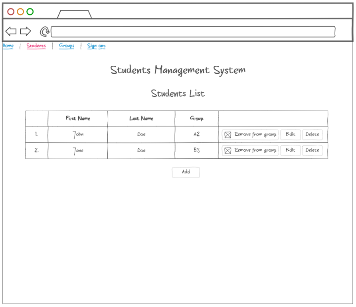

# Students Management

## Short Description

Create an app that helps to manage students and groups

## Estimation (h)

56

## Topics

* Angular
* REST API

## Requirements

Create an Angular application that provides functionality to manage groups and groups of students. Also contains basic
setup for application as Sign Up, Sign In, Sign Out. It is necessary to use ReactiveForms, HttpClient, RoutingModule and
supplementary features of the core to build the app

1. User should be navigated to /sign-in page by default if he is not logged in into system
   
2. User should be registered first before he logs in into application
   
3. User should provide correct username and password to be able to log in into application, same as for sign upping too
4. In case if input is invalid application should show messages with errors which prevent a user from logging in into
   system
5. After user's successful sign up or sign in, the application should navigate to /home
   
6. Sign up & Sign in page should contain header with the name of the app and form with two field for Username and
   password, also there should button to submit provided data
7. Home page should have basic menu at the top of the page with possibility to perform Sign out, also there should be
   printed "Welcome" message
8. Click on the Users link on top menu should navigate user to Users
   List page
   
   
   
   * it should have a list of students that currently is populated into system
   * it should have buttons at the right of each entry to edit and delete respective entries
   * at the bottom of the list it should contain the Add button to add new entry
   * the New student entry should have student's username and password, group to select to which user belongs and Save
     button to save entered data
   * after user entered data it should show the notification messages if it was successfully
   * if user click on Remove from group or Delete button it should first show the confirmation popup that if user is
     sure about completing this action
9. Click on the Groups link on menu should navigate user to Groups
   List page
   
   
   
   * it should have a list of group that are currently added to system
   * it should buttons to edit and delete certain group
   * at the bottom of the list it should have the Add button to add new entry of group
   * the New group entry should have the title input and Save button
   * it should show notification after new group entry has been successfully saved
   * if user click on Delete button it should first show the confirmation popup

## Advanced Requirements

1. Enrich application with functionality to access the application with
   different roles: Admin & Student
   * Admin should be able to perform all the actions under all pages
   * Student is restricted to only view the content of Students list and the list of Groups
2. Emulate all the data operations with http calls using HttpClient
3. Apply validations on forms that are used in the app, show respective
   error messages if the input is invalid

## Common Mistakes and Questions

### Questions

Q: Should I use some back-end solution and database?
A: Yes, you are free to emulate API in different ways
