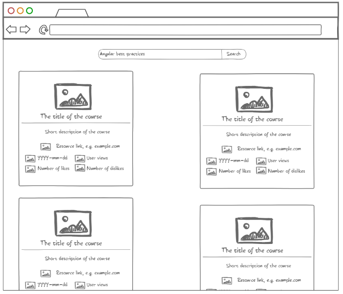
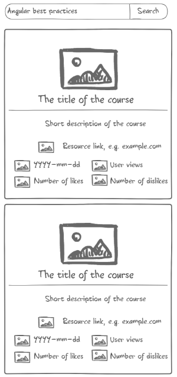

# YouTube Videos Search

## Short Description

Create a web app to view information about Youtube videos.

## Estimation (h)

32

## Topics

* Angular
* REST API
* RxJS

## Requirements

Create a web page using Angular and RxJS where users can search for YouTube videos (display list results) using Youtube
REST API.

* Each item should have information about:
  * Title
  * Description
  * Rate
  * Preview (as a picture)
   * Etc...
* All data should be loaded by chunks.
* Progressive data loading by emulating infinite scrolling experience.
* App's repo should have at least 5 commits.
* Shared components as independent module are required.

## Advanced Requirements

* App should support mobile browsers. See image below. 
* Results list should be scrolled via mouse swipe on desktop version and with swipe on mobile version.
* Results list should have pagination.

## Common Mistakes and Questions

### Questions

Q: Where can I find information about YouTube API?
A: <https://developers.google.com/youtube/v3/>

Q: Should I use Router for this App?
A: No. It is enough to use only one page.
